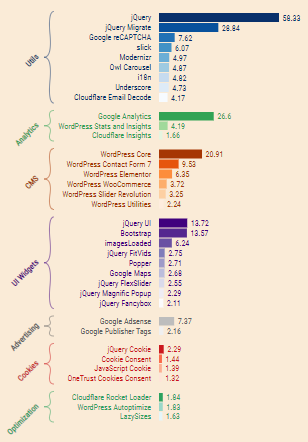

### Javascript Libraries From Top 1 Million Sites

CSV files available as [open access dataset](https://zenodo.org/record/6617972)
- getsetfetch-dataset-javascript-libraries.csv.gz (146 MB)
    - Each row contains a page URL followed by script source URLs (absolute or relative) encountered in that page. Inline scripts have an \"\<inline>" value. \
    ex: https:// sitemaps.org/,"\<inline>","/lang.js"

- getsetfetch-dataset-javascript-libraries-frequency-count.csv.gz (214 KB) 
    - Each row contains a partial script pathname followed by a frequency count. 
    The pathname is split in fragments based on "/" and expanded from right to left until the first non-generic fragment is found. If the full pathname contains only generic keywords (index, main, dist, etc...) the script hostname is added as well. Common suffixes like .min, .min.js are removed. \
    ex: jquery/ui/core,62554


#### Get Input Data
The project scrapes URLs from Majestic 1 Million (June 5th, 2022). \
Download the csv from the [official site](https://majestic.com/reports/majestic-million). \
Keep 3rd column with the domain name. Manually remove 1st row containing labels.
```bash
cd ansible/files
cut -d, -f 3 downloaded-majestic-million.csv > majestic-million-compact.csv
sed -i '1d' majestic-million-compact.csv
```

majestic-million-compact.csv is referenced by ansible playbook [scraper-setup.yml](ansible/scraper-setup.yml). It will be used to add the URLs to the initial scraping queue.

#### Scrape in Cloud
See [getsetfetch.org/blog/cloud-scraping-running-existing-projects.html](https://getsetfetch.org/blog/cloud-scraping-running-existing-projects.html) on detailed instructions on how to setup Terraform and Ansible, start scraping, monitor progress and export scraped content.

The defined terraform module [main.tf](terraform/main.tf) provisions one central PostgreSQL instance and 20 scraper instances deployed on DigitalOcean Frankfurt FRA1 datacenter.

```bash
terraform apply \
-var "api_token=${API_TOKEN}" \
-var "public_key_file=<public_key_file>" \
-var "private_key_file=<private_key_file>" \
-parallelism=30
```

#### Summarize Scraped Data
```bash
cd charts/extract
npx ts-node summarize-js-libs.ts
```

#### Generate Chart(s)
Start a basic http server serving static files from current directory on localhost:9000.
```bash
cd charts
npx ts-node ../../utils/serve-static.ts
```
#### Most Used Javascript Libraries (percentage)


- http://localhost:9000/most-used-js-libs.html
- filters out libraries with less than 1% usage
- groups libraries into categories with each category having a maximum of 9 entries
